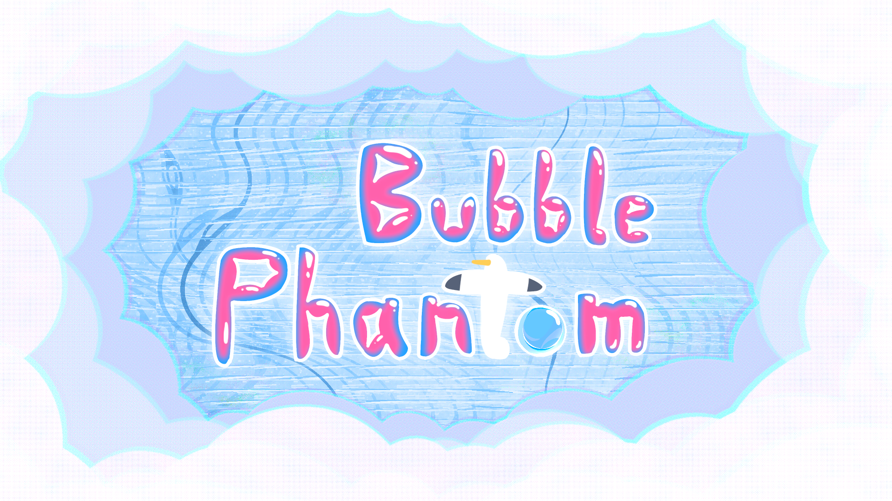

# Bubble-Phantom
Global Game Jam 2025, "Bubble"

## Introduction

*Bubble Phantom* is a minimalist action game that puts your rapid-response skills to a test.

In this game, you will play as a bubble that emerges from the ocean. While engaging in a profound conversation about the "ultimate goal" with a  seagull, a disagreement breaks out, plunging you into an unequal-strength battle: fragile bubble vs rampaging seagull.

When struck by the seagull, the bubble will pop instantly, but the impact of the popping can also deal damage to the seagull.

The bubble can move and dodge freely, but it will become smaller and smaller as a result. A bubble that is too tiny will evaporate in the air.

When a perfect dodge is executed, a **bubble phantom** will be generated. You can absorb a phantom to maintain your own size. When your bubble pops, if there are bubble phantoms in existence, you can control one and continue the battle.

So, stay sharp and watch the seagulls' every move. Dodge nimbly and claim your victory!

**Control:**

W/S/A/D - Movement

Space - Dodge

## 简介

《泡影》是一款考验快速反应能力的轻简动作游戏。

玩家是一颗自海洋中诞生的泡泡，在与一只海鸥探讨“终极目标”时发生了意见的分歧，不得不在海面上展开一场并不公平的对决。

游戏的内容为一场Boss战，由脆弱的泡泡对战肆意横行的海鸥，泡泡在海鸥的撞击下会瞬间爆裂，但爆裂产生的冲击力也能削减海鸥的生命值。

玩家拥有移动与闪避的能力，但代价是自身会因为行动而逐渐变小，过于微小的泡泡将会直接蒸发。

当触发完美闪避时，玩家就可以分身产生**泡影**，玩家可以吸收泡影来维持自身的大小，而当玩家不幸殒命，也能在当前场上的泡影中复生。

仔细观察海鸥的行动，在灵活的闪避中找到以弱胜强的机会吧！

**操作方式：**

W/S/A/D - 移动

Space - 闪避

## Screenshots

.jpg)

.jpg)

.jpg)

.PNG)

.PNG)
